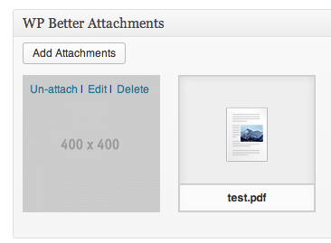
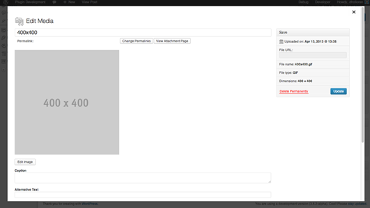
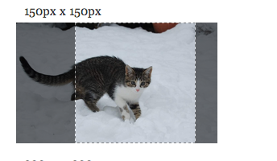

#WP Better Attachments

**Description:** WordPress plugin that allows you to add/edit/attach/un-attach/sort the files attached to your WordPress posts all from the post editor.  Integrates seamlessly with WordPress using the default WordPress attachments type and no configuration needed to add WP Better Attachments to custom post types. You can now also have full control over cropping of the different attachment image sizes through the media editor.

**Plugin Home Page:** [http://wordpress.org/extend/plugins/wp-better-attachments/](http://wordpress.org/extend/plugins/wp-better-attachments/)

####Thanks to these projects:

- [WP Settings API Bootstrap](https://github.com/DerekMarcinyshyn/wp-settings-api-bootstrap)
- [FlexSlider 2](http://www.woothemes.com/flexslider/2/)
- [Img Area Select](http://odyniec.net/projects/imgareaselect/)

*If your project is included and I do not have you added please let me know, thank you.*

If you have any issues please submit an [issue](https://github.com/DHolloran/wp-better-attachments/issues/new) or fix it/submit a pull request I will try to handle it ASAP. You an also contact me at [Dan@danholloran.com](mailto:dan@danholloran.com).

---
###WPBA Attachments Exist
`wpba_attachments_exist( array )`  

####Default Parameters
- post_id => current post id **Will retrieve attachments from the passed ID if available**
- show_post_thumbnail => true

`returns boolean`

---
###WPBA Get Attachments

`wpba_get_attachments( array )`

####Default Parameters
- post_id => current post id **Will retrieve attachments from the passed ID if available**
- show_post_thumbnail => true

`returns object`

---

###WPBA Attachment List Shortcode
`[wpba-attachment-list]`

####Default Parameters
- post_id="current_post_id"
- show_icon="false"
- file_type_categories="image,file,audio,video"
- file_extensions="png,pdf" **Array of file extensions, defaults to WordPress allowed attachment types (get_allowed_mime_types())**
- image_icon="path/to/directory/image-icon.png"
- file_icon="path/to/directory/file-icon.png"
- audio_icon="path/to/directory/audio-icon.png"
- video_icon="path/to/directory/video-icon.png"
- icon_size="16,20" **width, height**
- use_attachment_page="true"
- open_new_window="true"
- show_post_thumbnail="true"
- no_attachments_msg="Sorry, no attachments exist."
- wrap_class="wpba wpba-wrap"
- list_class="unstyled"
- list_id="wpba_attachment_list"
- list_item_class="wpba-list-item pull-left"
- link_class="wpba-link pull-left"
- icon_class="wpba-icon pull-left"

###WPBA Attachment List Shortcode/Function
`wpba_attachment_list( array() );`
####Default Parameter
- post_id				     => current_post_id
- show_icon            => false
- file_type_categories => array( image,file,audio,video )
- file_extensions      => array( png, pdf, ... ) // Array of file extensions, defaults to WordPress allowed attachment types (get_allowed_mime_types())
- image_icon           => "path/to/directory/image-icon.png"
- file_icon            => "path/to/directory/file-icon.png"
- audio_icon           => "path/to/directory/audio-icon.png"
- video_icon           => "path/to/directory/video-icon.png"
- icon_size            => array( 16,20 ); // string or number (width, height)
- use_attachment_page  => true
- open_new_window      => true
- show_post_thumbnail  => true
- no_attachments_msg   => Sorry, no attachments exist.
- wrap_class           => wpba wpba-wrap
- list_class           => unstyled
- list_id              => wpba_attachment_list
- list_item_class      => wpba-list-item pull-left
- link_class           => wpba-link pull-left
- icon_class           => wpba-icon pull-left

##Screenshots
###WPBA Post Editor Button

###WPBA Meta Box

###WPBA Unattach Media Library Link

###WPBA Attachment Editor

###WPBA Crop Editor

###WPBA Attachment List

##Getting Started
To get started with WP Better Attachments you can download it directly [here](https://github.com/DHolloran/wp-better-attachments/archive/master.zip), search for WP Github Recent Commit in your administrator section's Plugins > Add New, or you can download it from the [Wordpress plugins directory](http://wordpress.org/extend/plugins/wp-github-recent-commit/)

###Wordpress Plugin Directory Instructions
1. Search for WP Better Attachments in Plugins > Add New
2. Install &amp; Activate WP Better Attachments
3. Go to any page/post/custom post type and start editing your attachments with ease. Use the add attachments button to add new attachments. You can Drag and drop your attachments to arrange their menu order.  Click the Un-attach link to un-attach the file from your post.

###Manual Install Instructions
1. Unzip your download and place in wp-content/plugins/
2. Activate WP Better Attachments in the Wordpress Admin area
3. Go to any page/post/custom post type and start editing your attachments with ease. Use the add attachments button to add new attachments. You can Drag and drop your attachments to arrange their menu order.  Click the Un-attach link to un-attach the file from your post.

